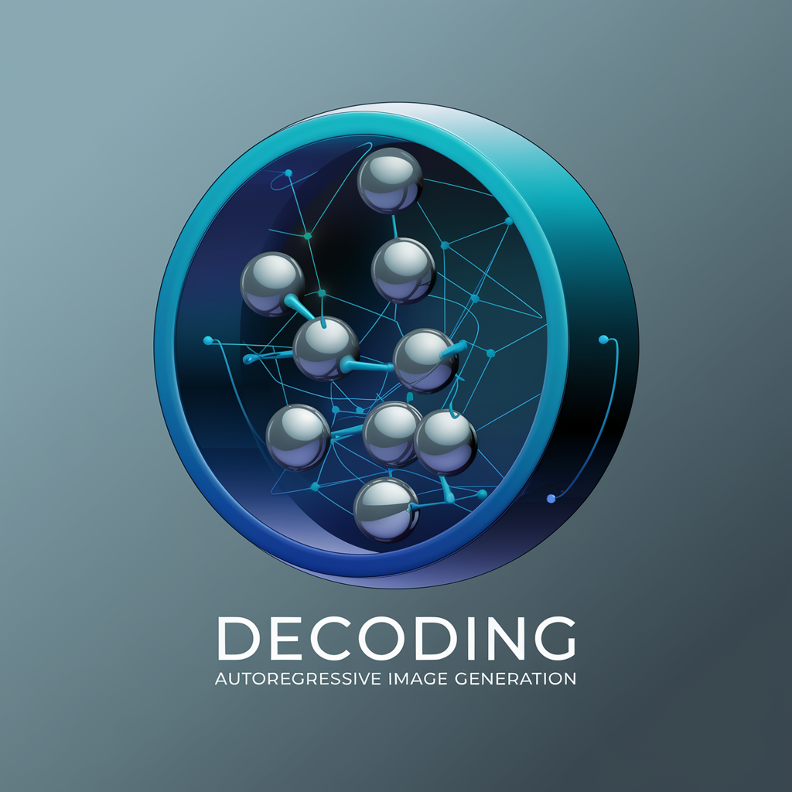

# ar-image-generation-decoding-toolkit

The **ar-image-generation-decoding-toolkit** is a specialized toolkit focused on decoding techniques for autoregressive image generation models. This toolkit implements several state-of-the-art decoding strategies, such as **minP**, **ensemble**, **dynamicT**, and **classifier-free guidance**, specifically designed to enhance the quality and control of generated images from autoregressive models.

In the future, more advanced decoding techniques will be added to improve functionality and expand the range of supported models.

## Table of Contents

- [Features](#features)
- [Installation](#installation)
- [Usage](#usage)
  - [Decoding Strategies](#decoding-strategies)
- [Configuration](#configuration)
- [Examples](#examples)
- [API Documentation](#api-documentation)
- [Contributing](#contributing)
- [License](#license)

## Features

- **Autoregressive Model Support**: Decode images from autoregressive models using advanced techniques.
- **Decoding Strategies**:
  - **minP**: Minimum Probability decoding for more accurate image synthesis.
  - **Ensemble**: Combine multiple decoding outputs for improved robustness.
  - **dynamicT**: Dynamic temperature adjustment during generation.
  - **Classifier-Free Guidance**: Control image generation with guidance-free adjustments.
- **Customizable Pipelines**: Easily integrate and experiment with different decoding strategies.
- **Future Expansion**: More advanced decoding techniques will be added in future releases.

## Installation

To install the toolkit, ensure you have Python 3.8 or higher and a working installation of `pip`. Install the package with:

```bash
pip install ar-image-generation-decoding-toolkit
